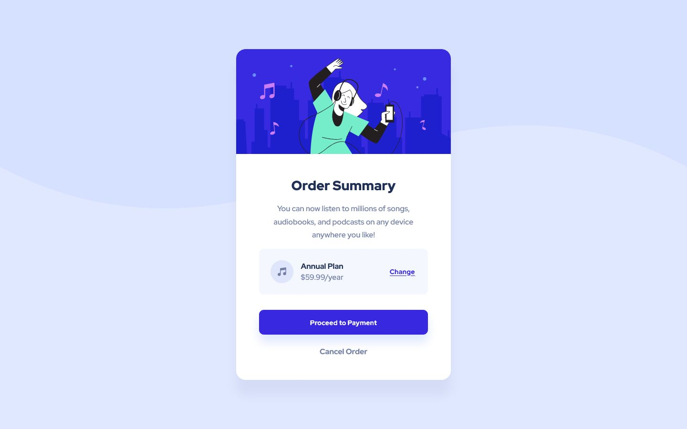

# Frontend Mentor - Order summary card solution

This is a solution to the [Order summary card challenge on Frontend Mentor](https://www.frontendmentor.io/challenges/order-summary-component-QlPmajDUj). Frontend Mentor challenges help you improve your coding skills by building realistic projects.

## Table of contents

- [Overview](#overview)
  - [Screenshot](#screenshot)
  - [Links](#links)
- [My process](#my-process)
  - [Built with](#built-with)
  - [What I learned](#what-i-learned)
- [Author](#author)

## Overview

Hi! This is my attempt at the Order summary card component challenge.

The challenge for this component was relatively straightforward. My approach was mobile-first, styling each portion of the component before fine-tuning spacing, sizing and layout after.

### Screenshot

Desktop

Mobile

### Links

- Solution URL: [Here!](https://github.com/sheronimo/frontendmentor-ordersummary)
- Live Site URL: [Here!](https://sheronimo.github.io/frontendmentor-ordersummary/)

## My process

1. I went for a mobile-first approach, working on the card as it appeared on small devices first.
2. I styled each portion and fine-tuned the spacing, sizing and positioning of each element, by comparing screenshots to the design images, before moving on to the next portion.
3. After completing all portions as they appeared on mobile, I then worked on the changes in background, spacing and sizing as they appeared on medium-sized screens (`768px`) and larger.

### Built with

- Semantic HTML5 markup
- SASS
- Flexbox
- Grid

### What I learned

I learned about how to work with "two-dimensional layouts within 2-dimensional layouts" and how to better utilise CSS Grid.

## Author

- Github - [sheronimo](https://github.com/sheronimo)
- Frontend Mentor - [@sheronimo](https://www.frontendmentor.io/profile/sheronimo)
